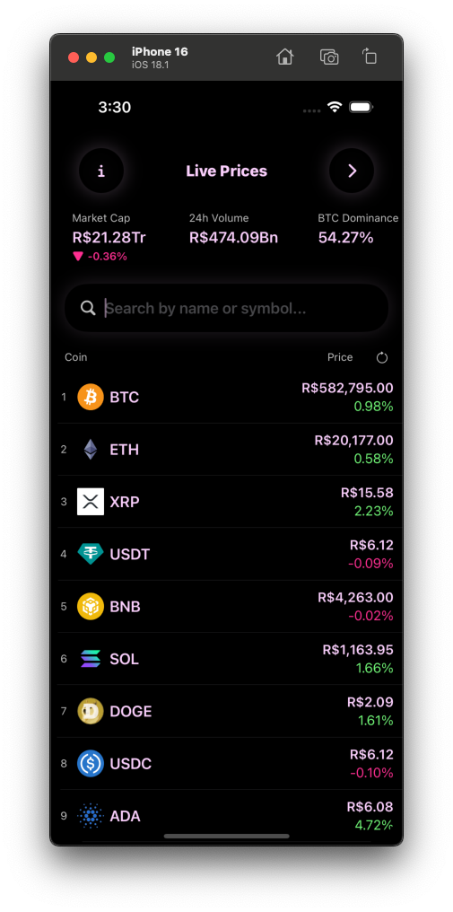
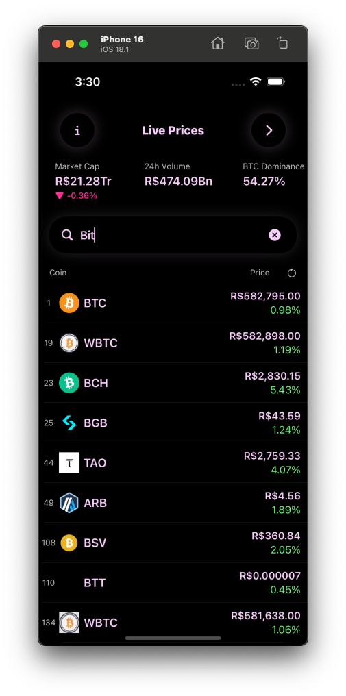
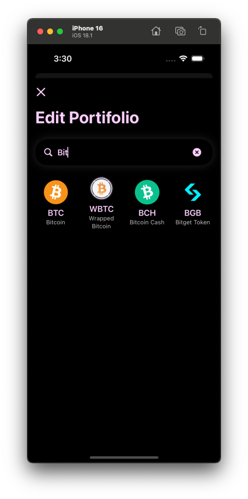
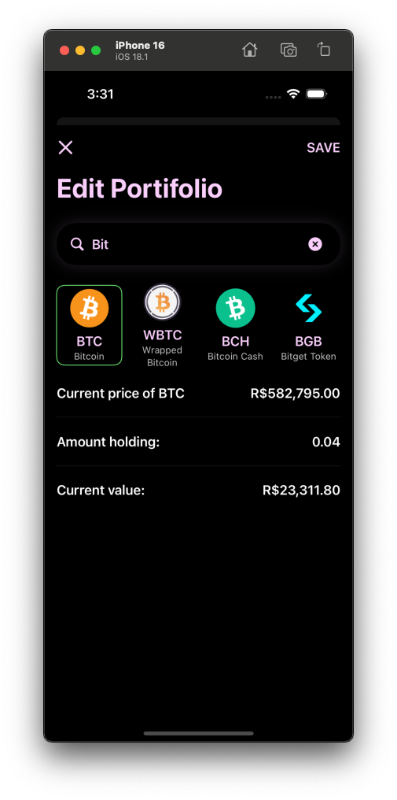
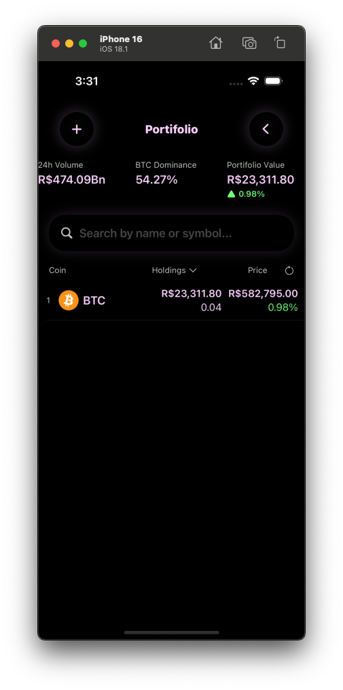
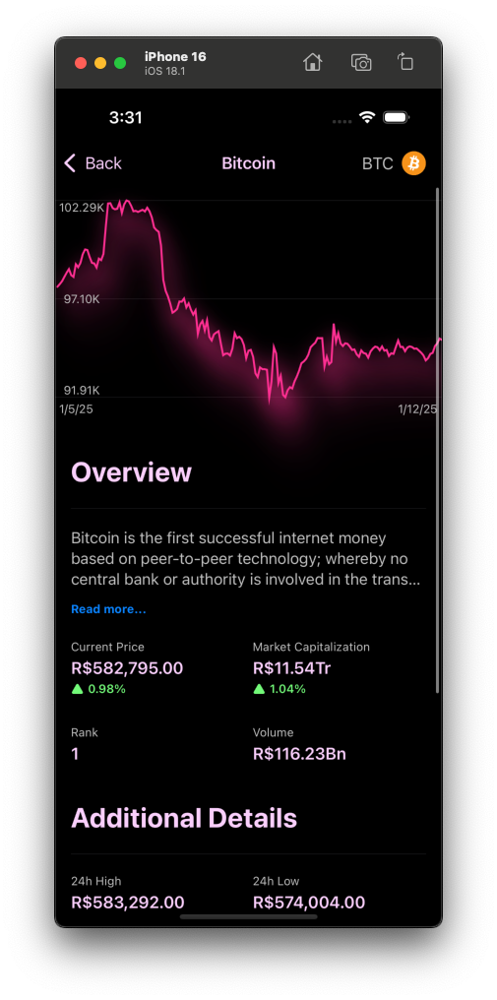

🚀 Crypto Tracker App 📱

This iOS cryptocurrency app empowers you to navigate the dynamic world of digital assets with real-time market data, detailed coin insights, and personalized portfolio tracking, all wrapped in a sleek and intuitive interface. ✨

Dive into the Future of Finance:

Leveraging the power of SwiftUI, this app delivers a modern and responsive experience. Stay ahead of the curve with live price updates, 24-hour change percentages, market capitalization rankings, and interactive sparkline charts. 📈 Explore individual coins with comprehensive descriptions, links to external resources, and historical performance data. Effortlessly manage your crypto holdings by adding coins to your portfolio and tracking their current value. 💰

Key Features:

Real-time Market Data: Track live prices, 24-hour changes, market cap, and volume for a vast selection of cryptocurrencies. 💸
Detailed Coin Information: Access in-depth descriptions, technical specifications, and relevant links for each coin. ℹ️
Portfolio Tracking: Manage your crypto investments and monitor their performance with ease. 💼
Interactive Charts: Visualize price trends with dynamic sparkline charts. 📉
User-Friendly Interface: Enjoy a clean and intuitive design for effortless navigation. 👌
Offline Storage: Access saved coin images and portfolio data even without internet connectivity. 💾
Haptic Feedback: Engage with subtle vibrations for a more immersive experience. 📳

Screenshots:

  
  
  
  
  
  

Demo Video:

https://github.com/user-attachments/assets/8f226664-dfb4-4b2d-a8ae-0fb634189d0f

Tech Stack:

SwiftUI
Combine
Core Data

Showcase Your Expertise:

This project demonstrates proficiency in building cutting-edge iOS applications with an emphasis on clean architecture, efficient data handling, and a polished user experience. The code is well-structured and documented, ensuring maintainability and ease of understanding. It's the perfect addition to your portfolio, highlighting your skills in the exciting realm of cryptocurrency and mobile development. 🌟

Remember to replace /path/to/screenshot.png with the actual paths to your screenshot images and link-to-your-demo-video with the actual link. You can also add more screenshots if needed.
